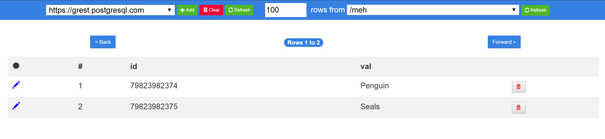

# Angular Postgrest

The goal of this project is to build a simple Angular UI client (CRUD) for Postgrest (Postgrest is a REST wrapper for PostgresSQL. See https://postgrest.com). 

## Development

To install the node dependencies the project run `npm i` from within the root directory.

Run `ng serve --open` for a dev server. Navigate to `http://localhost:4200/`. 

The app will automatically reload if you change any of the source files.

## Build

Run `./build.sh` to build the project or
Run `ng build --prod --aot=false` .

## Features

### Completed

  - Managing Postgrest endpoints
  - Table selection
  - Table pagination
  - Table pagination size
  - Update row (**currently testing for non-text fields**)
  - Delete row (with confirmation)

### Next to be implemented

  - Insert new row
  - Simple queries (AND only)

### Planned

  - Complex queries (Support for AND, OR)
  - Security headers
  - Persisting defaults
  - Saving & loading settings (Google drive)
  - Host latest release on Github pages
  - Docker image (Alpine, Nginx)
  - Heroku button
  - Clear exception communication

### Stack

  - **Angular 4**
  - **Bootstrap 4**
  - **Sweet Alert 2**
  - **Karma**
  - Postgrest

